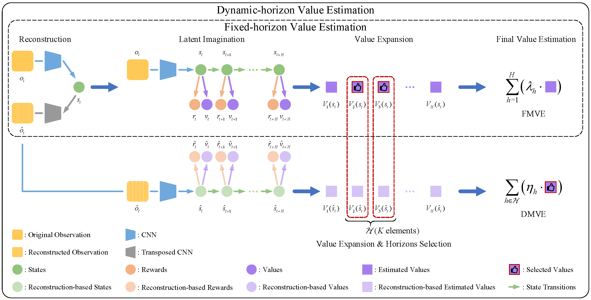

# Dynamic-horizon Model-based Value Expansion (DMVE)

This repository implements the main algorithm of DMVE described in "Dynamic-horizon Model-based Value Estimation with Latent Imagination" (IEEE Transactions on Neural Networks and Learning Systems).

## Method



The overview of Dynamic-horizon Model-based Value Expansion (DMVE). DMVE dynamically adjusts the rollout horizon according to the value expansion errors between the original and reconstructed images. The framework consists of two parts, the first part is value expansion based on the fixed rollout length with latent imagination, and on the basis of the first part, the second part dynamically adjusts the rollout horizon by its reliability, which is reflected by the difference between the value expansion for both reconstructed and the raw images. 

## Instructions

Get dependencies:

Install MuJoCo 2.1.0 at ~/.mujoco/mujoco210 and copy your license key to ~/.mujoco/mjkey.txt

Install required packages with

```
conda create -n dmve python=3.7
conda activate dmve
pip install -r requirements.txt
```

Train the agent:

```
python dmve.py --logdir ./logdir/dmc_walker_run/dmve/1 --task dmc_walker_run
```

Generate plots:

```
python plotting.py --indir ./logdir --outdir ./plots --xaxis step --yaxis test/return --bins 3e4
```

Graphs and GIFs:

```
tensorboard --logdir ./logdir
```
